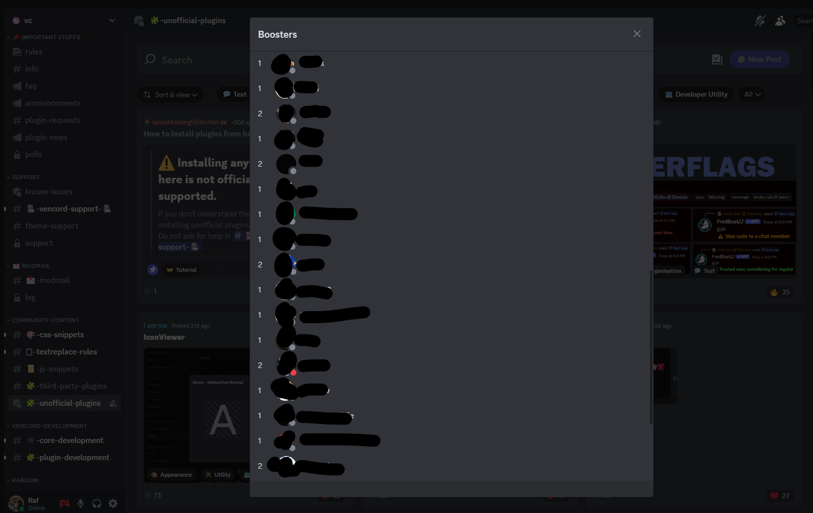

# BoosterCount

Vencord plugin to show boosters for a server, and how many times they are boosting the server.



Can be used by right clicking a server, and selecting the `View Boosters` buttons in the context menu.

⚠️ This only works for servers where you have enough permissions to access the server settings through the UI.

# How to install 🔧

If you don't know what you're doing, read [Vencord instructions on installing custom plugins](https://docs.vencord.dev/installing/custom-plugins/).
Come back here once you're done.

By now, you should have cloned the Vencord repository, pointed your terminal to the Vencord folder, and created a `userplugins` folder inside it. If you indeed have done all this, do the following:

1. Change your current directory on your terminal to the `userplugins` folder, e.g. `cd src/userplugins`.
2. Run the following command to download the plugin into the `userplugins` folder.

```bash
git clone https://github.com/Reathe/BoosterCount
```

3. [Compile and install Vencord](https://docs.vencord.dev/installing/) again.

## How to update the plugin

You will have to direct your terminal to the plugin folder (`cd src/userplugins/BoosterCount`) and run:

```sh
git pull
```

Then [build and install Vencord](https://docs.vencord.dev/installing/) again.
