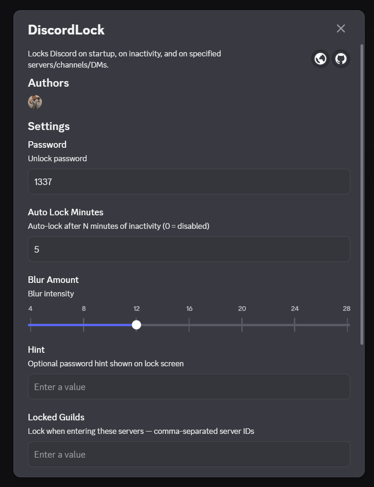
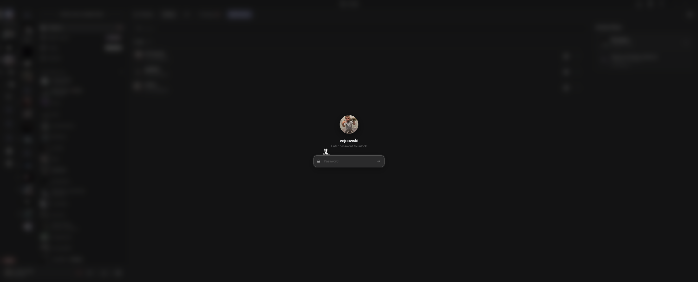

# DiscordLock

Locks Discord on startup. Enter a password to get in.
Built for [Vencord](https://vencord.dev) — requires building from source.

<p align="center">
  
  <br/><br/>
  
</p>


---

## What it does

- Locks on every Discord launch
- Auto-locks after X minutes of inactivity
- Can lock specific servers, channels or DMs separately
- Asks for password only once per session per server (configurable)
- Adjustable blur intensity
- Rate-limits wrong attempts (5 tries → 15s cooldown)
- Optional hint text on the lock screen

## Setup

You'll need **Node.js**, **Git** and **pnpm** (`npm i -g pnpm`).

```bash
git clone https://github.com/Vendicated/Vencord
cd Vencord
pnpm install --frozen-lockfile
```

Create the plugin folder and drop `index.ts` inside:

```
Vencord/src/userplugins/discordLock/index.ts
```

Then build and inject:

```bash
pnpm build
pnpm inject   # only needed once
```

Restart Discord, go to **Settings → Plugins**, find **DiscordLock** and enable it.

---

## Settings

Found under **Settings → Plugins → DiscordLock**.

| Option | Default | Description |
|---|---|---|
| Password | `1337` | Password to unlock |
| Auto-lock (minutes) | `5` | Inactivity timeout, `0` to disable |
| Blur intensity | `18` | How strong the background blur is (4–28) |
| Hint | — | Optional hint shown on the lock screen |
| Locked Guilds | — | Server IDs, comma-separated |
| Locked Channels | — | Channel IDs, comma-separated |
| Locked Users | — | User IDs for DM locks, comma-separated |
| Lock once per session | `on` | When enabled, only asks for password once per server/channel/DM per session instead of every time you switch |

To grab IDs, enable **Developer Mode** first (`Settings → Advanced`), then right-click any server, channel or user → *Copy ID*.

---

## Updating

```bash
git pull
pnpm install --frozen-lockfile
pnpm build
```

## Removing

Disable in Vencord settings, delete the `discordLock` folder, rebuild.

---

> Password is stored in plain text in Vencord's settings file. This isn't a serious security measure — just keeps people out of your Discord when you step away.
## Credits

Made by **vejcowski** — do not remove or change the author credit if you're redistributing or modifying this plugin. A mention or link back is appreciated.
If you fork this, keep the original author in `index.ts` and here - thanks.
