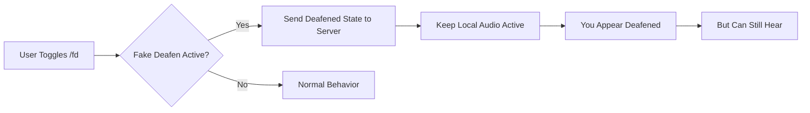

<div align="center">

# 🎧 Fake Deafen

### *Appear deafened while still hearing everything*

[](https://www.gnu.org/licenses/gpl-3.0)
[](https://vencord.dev/)
[](https://www.typescriptlang.org/)

A lightweight Vencord plugin that allows you to appear deafened in Discord voice channels while maintaining full audio reception. Perfect for privacy-conscious users who want to listen without broadcasting their listening status.

[Installation](#-installation) • [Usage](#-usage) • [Features](#-features) • [Troubleshooting](#-troubleshooting)

</div>

---

## 📋 Table of Contents

- [Features](#-features)
- [How It Works](#-how-it-works)
- [Prerequisites](#-prerequisites)
- [Installation](#-installation)
- [Usage](#-usage)
- [Configuration](#-configuration)
- [Troubleshooting](#-troubleshooting)
- [FAQ](#-faq)
- [Disclaimer](#%EF%B8%8F-disclaimer)
- [Contributing](#-contributing)
- [License](#-license)

---

## ✨ Features

<table>
<tr>
<td width="50%">

### 🔇 Stealth Mode
Appear deafened to all other users in the voice channel while your audio remains fully functional.

</td>
<td width="50%">

### ⚡ Instant Toggle
Quick `/fd` command to toggle fake deafen on and off without leaving the voice channel.

</td>
</tr>
<tr>
<td width="50%">

### 🎯 Precise Control
Customizable settings to control mute behavior and deafen state transmission.

</td>
<td width="50%">

### 🪶 Lightweight
Minimal performance impact with efficient patching of Discord's voice state system.

</td>
</tr>
</table>

---

## � How It Works

Fake Deafen operates by intercepting Discord's voice state update mechanism:



### Technical Details

The plugin patches the `voiceStateUpdate` function to modify the behavior of the deafen toggle:

| Component | Normal Deafen | Fake Deafen |
|-----------|---------------|-------------|
| **Server State** | ✅ Deafened | ✅ Deafened |
| **Client Audio** | ❌ Disabled | ✅ Enabled |
| **Others See You As** | 🔇 Deafened | 🔇 Deafened |
| **You Can Hear** | ❌ No | ✅ Yes |

**Key Mechanism:**
1. Intercepts the `self_deaf` parameter in voice state updates
2. Sends `true` to Discord servers (you appear deafened)
3. Prevents local audio stream disconnection
4. Maintains full audio reception on your client

---

## 📦 Prerequisites

Before installing Fake Deafen, ensure you have the following:

### Required Software

| Software | Version | Purpose | Download |
|----------|---------|---------|----------|
| **Node.js** | v18+ | JavaScript runtime | [nodejs.org](https://nodejs.org/) |
| **pnpm** | Latest | Package manager | [pnpm.io](https://pnpm.io/) |
| **Git** | Latest | Version control | [git-scm.com](https://git-scm.com/) |
| **Vencord** | Source | Discord client mod | [vencord.dev](https://vencord.dev/) |

### System Requirements

- **OS:** Windows 10/11, macOS 10.15+, or Linux
- **RAM:** 4GB minimum (8GB recommended)
- **Disk Space:** 500MB for Vencord source + dependencies
- **Discord:** Desktop client (Stable, PTB, or Canary)

---

## 🚀 Installation

### Step 1: Set Up Vencord

If you haven't already installed Vencord from source, follow these steps:

```bash
# Clone the Vencord repository
git clone https://github.com/Vendicated/Vencord.git
cd Vencord

# Install dependencies
pnpm install --frozen-lockfile
```

> **💡 Tip:** This may take 5-10 minutes depending on your internet connection.

### Step 2: Download Fake Deafen

Choose one of the following methods:

#### Option A: Direct Download

1. Download [`fakeDeafen.tsx`](https://raw.githubusercontent.com/fizzexual/FakeDeafenVencord/master/fakeDeafen.tsx)
2. Save it to your Downloads folder

#### Option B: Git Clone

```bash
git clone https://github.com/fizzexual/FakeDeafenVencord.git
cd FakeDeafenVencord
```

### Step 3: Install the Plugin

#### Windows

```powershell
# Create userplugins directory if it doesn't exist
mkdir Vencord\src\userplugins -Force

# Copy the plugin file
copy fakeDeafen.tsx Vencord\src\userplugins\
```

#### Linux / macOS

```bash
# Create userplugins directory if it doesn't exist
mkdir -p Vencord/src/userplugins

# Copy the plugin file
cp fakeDeafen.tsx Vencord/src/userplugins/
```

### Step 4: Build Vencord

```bash
cd Vencord

# Build Vencord with your custom plugin
pnpm build

# Inject into Discord
pnpm inject
```

> **⚠️ Note:** You may need to select which Discord installation to inject into (Stable, PTB, or Canary).

### Step 5: Enable the Plugin

1. **Restart Discord** completely (close from system tray)
2. Open Discord **Settings** (⚙️)
3. Navigate to **Vencord** → **Plugins**
4. Find **"FakeDeafen"** in the plugin list
5. Toggle it **ON** ✅

<div align="center">

**🎉 Installation Complete!**

</div>

---

## 🎮 Usage

### Basic Commands

| Command | Description | Example |
|---------|-------------|---------|
| `/fd` | Toggle fake deafen on/off | Type `/fd` in any text channel |

### Step-by-Step Usage

1. **Join a Voice Channel**
   - Click on any voice channel to join
   - Wait until you're connected

2. **Activate Fake Deafen**
   - Type `/fd` in any text channel
   - You'll see: 🔴 **Fake deafen: ON**

3. **Verify Status**
   - You appear deafened to others (🔇 icon)
   - You can still hear everyone speaking
   - Only you see the status message

4. **Deactivate When Done**
   - Type `/fd` again
   - You'll see: ⚪ **Fake deafen: OFF**

### Status Indicators

| Indicator | Meaning | Visible To |
|-----------|---------|------------|
| 🔴 **Fake deafen: ON** | You appear deafened but can hear | Only you |
| ⚪ **Fake deafen: OFF** | Normal deafen behavior | Only you |
| 🔇 Deafened icon | Others see you as deafened | Everyone |

### Use Cases

- **🎧 Passive Listening:** Listen to conversations without appearing active
- **🎮 Gaming:** Hear teammates while appearing AFK
- **📚 Study Sessions:** Listen to study groups without broadcasting presence
- **🎵 Music Bots:** Enjoy music while appearing deafened
- **🔒 Privacy:** Control when others know you're listening

---

## ⚙️ Configuration

Access plugin settings in **Discord Settings → Vencord → Plugins → FakeDeafen**

### Available Settings

#### Keep Mute State When Fake Deafened

```
Type: Boolean
Default: ✅ Enabled
```

**Description:** Maintains your microphone mute status while fake deafened.

- **Enabled:** Your mute state is preserved (recommended)
- **Disabled:** Mute state may change when toggling fake deafen

**When to use:**
- ✅ Keep enabled if you want consistent mute behavior
- ❌ Disable if you want independent mute control

---

#### Send Deafen State to Server

```
Type: Boolean
Default: ✅ Enabled
```

**Description:** Controls whether the deafen state is sent to Discord servers.

- **Enabled:** You appear deafened to others (normal operation)
- **Disabled:** Experimental - may cause unexpected behavior

**When to use:**
- ✅ Keep enabled for normal fake deafen operation
- ⚠️ Only disable for testing purposes

---

## 🐛 Troubleshooting

### Common Issues

<details>
<summary><b>❌ Plugin doesn't appear in Vencord settings</b></summary>

**Possible Causes:**
- Plugin file not in correct location
- Build errors during compilation
- Vencord not properly installed

**Solutions:**

1. **Verify file location:**
   ```bash
   # The file should be here:
   Vencord/src/userplugins/fakeDeafen.tsx
   ```

2. **Check for build errors:**
   ```bash
   cd Vencord
   pnpm build
   # Look for any error messages
   ```

3. **Rebuild from scratch:**
   ```bash
   cd Vencord
   pnpm install --frozen-lockfile
   pnpm build
   pnpm inject
   ```

4. **Restart Discord completely:**
   - Close Discord from system tray
   - Wait 5 seconds
   - Reopen Discord

</details>

<details>
<summary><b>❌ /fd command doesn't work</b></summary>

**Possible Causes:**
- Plugin not enabled
- Not in a voice channel
- Command conflicts

**Solutions:**

1. **Verify plugin is enabled:**
   - Settings → Vencord → Plugins
   - Find "FakeDeafen" and ensure it's toggled ON

2. **Join a voice channel first:**
   - The command only works when connected to voice

3. **Try reloading Discord:**
   - Press `Ctrl+R` (Windows/Linux) or `Cmd+R` (Mac)

4. **Check console for errors:**
   - Press `Ctrl+Shift+I` to open DevTools
   - Look for red error messages in Console tab

</details>

<details>
<summary><b>❌ Can't hear audio when fake deafened</b></summary>

**Possible Causes:**
- Audio device issues
- Discord audio settings
- Plugin conflict

**Solutions:**

1. **Toggle fake deafen off and on:**
   ```
   /fd  (turn off)
   /fd  (turn on again)
   ```

2. **Check Discord audio settings:**
   - Settings → Voice & Video
   - Verify correct output device selected
   - Test audio with "Let's Check" button

3. **Rejoin the voice channel:**
   - Disconnect from voice
   - Wait 2 seconds
   - Reconnect

4. **Check system audio:**
   - Ensure Discord isn't muted in system mixer
   - Verify volume levels are up

</details>

<details>
<summary><b>❌ Build errors when compiling Vencord</b></summary>

**Possible Causes:**
- Outdated dependencies
- Node.js version mismatch
- Syntax errors in plugin file

**Solutions:**

1. **Update dependencies:**
   ```bash
   cd Vencord
   pnpm install --frozen-lockfile
   ```

2. **Check Node.js version:**
   ```bash
   node --version
   # Should be v18 or higher
   ```

3. **Verify plugin file integrity:**
   - Re-download `fakeDeafen.tsx` from this repo
   - Ensure no modifications were made

4. **Check for TypeScript errors:**
   ```bash
   cd Vencord
   pnpm build --dev
   # Look for specific error messages
   ```

</details>

<details>
<summary><b>❌ Others can tell I'm using fake deafen</b></summary>

**This is not possible.** The plugin operates entirely client-side and server-side. Other users only see:
- 🔇 Deafened icon next to your name
- Standard deafened status

There is no way for others to detect you're using fake deafen unless you tell them.

</details>

### Getting Help

If you're still experiencing issues:

1. **Check existing issues:** [GitHub Issues](https://github.com/fizzexual/FakeDeafenVencord/issues)
2. **Open a new issue:** Include:
   - Operating system and version
   - Discord version (Stable/PTB/Canary)
   - Vencord version
   - Error messages from console
   - Steps to reproduce the problem

---

## ❓ FAQ

### General Questions

**Q: Is this safe to use?**  
A: The plugin only modifies client-side behavior and doesn't interact with Discord's API in unauthorized ways. However, using any client modification carries inherent risks (see [Disclaimer](#%EF%B8%8F-disclaimer)).

**Q: Can others detect I'm using this?**  
A: No. The plugin operates transparently and others only see standard deafened status.

**Q: Does this work on mobile?**  
A: No. This is a Vencord plugin which only works on desktop Discord clients.

**Q: Will this work with Discord updates?**  
A: The plugin may break with major Discord updates. Check this repo for updates if it stops working.

### Technical Questions

**Q: How does this differ from just muting my audio?**  
A: Muting audio still shows you as listening. Fake deafen shows you as deafened (not listening) while you actually are.

**Q: Does this affect my microphone?**  
A: No. Your microphone state is independent and controlled by the "Keep mute state" setting.

**Q: Can I use this with other Vencord plugins?**  
A: Yes. Fake Deafen is compatible with other Vencord plugins.

**Q: Does this consume extra bandwidth?**  
A: No. You're still receiving audio normally, so bandwidth usage is identical to regular listening.

### Privacy Questions

**Q: Does this send any data anywhere?**  
A: No. The plugin operates entirely locally and only communicates with Discord's standard voice servers.

**Q: Can Discord detect this plugin?**  
A: Discord can potentially detect client modifications. Use at your own risk.

**Q: Is my account safe?**  
A: While many users use client mods without issue, Discord's ToS prohibits client modifications. See [Disclaimer](#%EF%B8%8F-disclaimer).

---

## ⚠️ Disclaimer

### Important Legal Information

This plugin modifies the Discord client, which may violate Discord's Terms of Service.

#### Risks

- ❌ **Account Suspension:** Discord may suspend or ban accounts using modified clients
- ❌ **No Warranty:** This software is provided "as is" without any guarantees
- ❌ **Educational Purpose:** This project is for educational purposes only
- ❌ **Use at Own Risk:** You assume all responsibility for using this plugin

#### Terms of Service

By using this plugin, you acknowledge that:

1. You have read and understand Discord's [Terms of Service](https://discord.com/terms)
2. You accept the risk of potential account action
3. The developers are not responsible for any consequences
4. This is an unofficial modification not endorsed by Discord Inc.

#### Recommendations

- 🔒 Use on a secondary/test account first
- 📚 Read Discord's ToS before using
- ⚖️ Understand the legal implications
- 🛡️ Don't use for malicious purposes

<div align="center">

**⚠️ USE AT YOUR OWN RISK ⚠️**

*Not affiliated with Discord Inc. or Vencord*

</div>

---

## 🤝 Contributing

Contributions are welcome and appreciated! Here's how you can help:

### Ways to Contribute

- 🐛 **Report Bugs:** Open an issue with detailed reproduction steps
- 💡 **Suggest Features:** Share your ideas for improvements
- 📝 **Improve Documentation:** Fix typos or clarify instructions
- 🔧 **Submit Code:** Create pull requests with bug fixes or features
- ⭐ **Star the Repo:** Show your support!

### Development Setup

```bash
# Fork and clone the repo
git clone https://github.com/fizzexual/FakeDeafenVencord.git
cd FakeDeafenVencord

# Make your changes to fakeDeafen.tsx

# Test in Vencord
cp fakeDeafen.tsx /path/to/Vencord/src/userplugins/
cd /path/to/Vencord
pnpm build

# Create a pull request
```

### Code Guidelines

- ✅ Follow existing code style
- ✅ Test your changes thoroughly
- ✅ Update documentation if needed
- ✅ Write clear commit messages

---

## 📄 License

This project is licensed under the **GNU General Public License v3.0**.

```
Fake Deafen - Vencord Plugin
Copyright (C) 2025 FakeDeafen Contributors

This program is free software: you can redistribute it and/or modify
it under the terms of the GNU General Public License as published by
the Free Software Foundation, either version 3 of the License, or
(at your option) any later version.
```

See [LICENSE](LICENSE) file for full details.

---

## 📚 Resources

### Official Documentation

- 📖 [Vencord Documentation](https://docs.vencord.dev/)
- 🔧 [Vencord GitHub](https://github.com/Vendicated/Vencord)
- 💬 [Discord Developer Portal](https://discord.com/developers/docs)

### Community

- 💬 [Vencord Discord Server](https://discord.gg/D9uwnpXXXX)
- 🐛 [Report Issues](https://github.com/fizzexual/FakeDeafenVencord/issues)
- 💡 [Request Features](https://github.com/fizzexual/FakeDeafenVencord/issues/new)

### Related Projects

- [Vencord](https://github.com/Vendicated/Vencord) - Discord client mod
- [BetterDiscord](https://betterdiscord.app/) - Alternative client mod
- [Discord.js](https://discord.js.org/) - Discord bot framework

---

<div align="center">

### 🌟 Star History

[](https://star-history.com/#fizzexual/FakeDeafenVencord&Date)

---

**Made with ❤️ for the Discord community**

**For support: lauzezzif** 

[⬆ Back to Top](#-fake-deafen)

</div>
